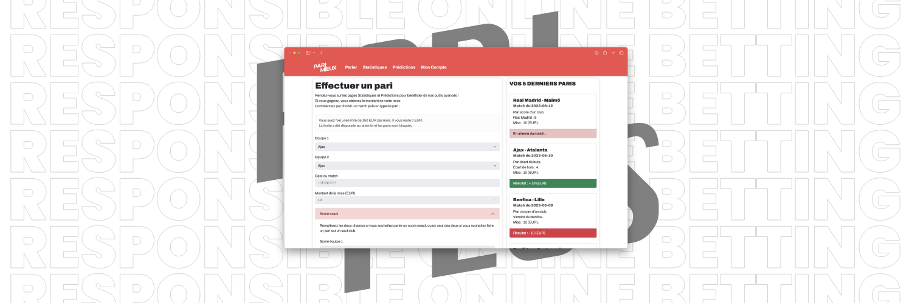

# Pariplus

**Pariplus** <small>(renamed to PariMieux for the final presentation)</small> **is an online betting platform designed with responsible betting and ease of use in mind.**

It fixes a **limit** by default to discourage players from betting too much each week, and includes a "**Predictions**" page to help new players know what team to bet on.

Pariplus was created as part of the **final project** ("projet transverse") of our third year at **Efrei Paris**. It was selected for the **TechDay**, a competition between the 12 best projects of second and third-year students.

## Technologies

Pariplus uses the following tech stack:

- HTML/CSS for the frontend
- PHP for the backend
- MySQL as a database
